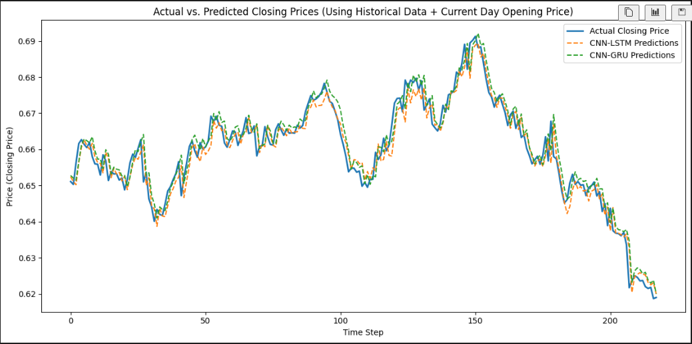
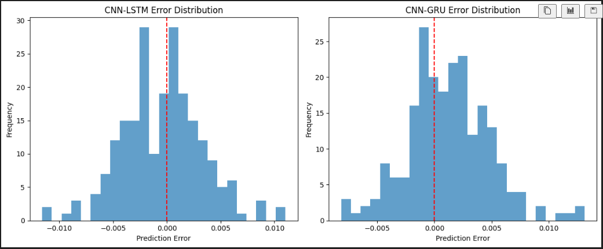

# LSTMvsGRU_Forecasting Public Repo

### This is an early learning project in a field I've become quite interested in, any feedback or critiques on my code or approach (especially if I missed any mistakes) is well appreciated!

### Update! Closing price forecasting tested on both architectures, see below for results

#### Summary
This is a comparison of CNN-LSTM (paper linked below) and CNN-GRU for financial forecasting tasks. This comparison was based on the task of 1 day forecasting, which both architectures excelled on with unseen data. While results should be considered weak, GRU actually outperformed LSTM, perhaps due to the simpler nature of the dataset and LSTM's extra parameters making it more prone to overfitting. 

While much work is to be done confirming the results (for example: no hyperparam tuning was used), these early experiments show that GRU (the simpler and faster architecture) may potentially outform LSTM on certain trading instruments, which yield potential applications in both desk and automated trading where nanoseconds count.

#### Some more details, an explanation of results.
To be more precise, the task is to forecast the next day's opening price. The entirely made up scenario which I created for myself was to help inform a trader's strategies at the opening of the market. The extremely high accuracy in predictions that can be seen below is very likely due to the high correlation between the current day's closing price and next day's opening price, which the model would pick up on. This inclusion of current days closing price significantly simplifies the prediction task. 

As mentioned above, GRU outperformed LSTM in terms of prediction accuracy, with an MAE of 0.0009 as opposed to 0.0011 on the LSTM based model. This result is to be considered **low yield** simply due to the fact that only one dataset was used, the task was quite simple, and the fact that no hyperparameter tuning was done. However in saying this, GRU is a much simpler architecture than LSTM with less gates and less parameters - it is possible that this reduction in complexity may lend itself well to the simpler task and smaller dataset. 

#### Future work
Furthermore, no ablation study was done. For example, the model uses the previous 30 days of data to make its prediction, I have not done any experiments on if changing the length of this window affects predictions or not. I also add some simple technical indicators, however am yet to show that these are actually useful. Verification of these ideas is to be left for future work. 

In addition to these, more work on more complex task such as trading at the close (forecasting closing prices instead) and multiday forecasting will follow to help distinguish between the capabilities of the two sister architectures.

The training dataset is drawn from real life historical data from: https://au.investing.com/currencies/aud-usd-historical-data

The training set is based on data from 2010 to 2024 starting from the peak of the AUD against the USD, and the test set is based on unseen data from 2024-2025.

CNN_LTSM paper: https://arxiv.org/pdf/2305.14378

### Trying both models on closing price prediction
As mentioned in the future work above closing price prediction was more challenging for the models, with a 2-3x higher MAE on average compared to the opening price predictions. The only changes to the models besides the target label during training is the addition of the current day's opening price, as in this scenario the model would be used prior to market close to inform strategy trading at the close (not sure how realistic this really is).

#### Results discussion
In this task both models performed similarly, with an average MAE of 0.0029 for both, this varied between runs when seed was changed where CNN-LSTM often performed slightly better. The closing of the gap between LSTM and GRU models may support the hypothesis raised in earlier experiments that GRU is better suited to less complex tasks. However, when it comes to error characteristics, the distribution of errors made in terms of distance between prediction and actual slightly favours GRU (I eyeballed it). You can see for yourself below. 

#### Future work
Future work has not changed a great deal with the exception of "testing models on closing prices" being somewhat completed. Once again however there is much work to be done on hyperparameter tuning, ablation studies and other further work to be done in supporting the validity of these experiments (which I must iterate again is quite poor).

