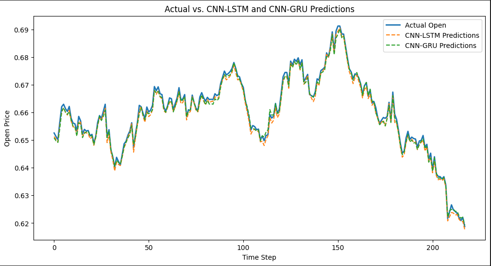

# LSTMvsGRU_Forecasting Public Repo

### This is an early learning project in a field I've become quite interested in, any feedback or critiques on my code or approach (especially if I missed any mistakes) is well appreciated!

#### Summary
This is a comparison of CNN-LSTM and CNN-GRU for financial forecasting tasks. This comparison was based on the task of 1 day forecasting, which both architectures excelled on with unseen data. While results should be considered weak, GRU actually outperformed LSTM, perhaps due to the simpler nature of the dataset and LSTM's extra parameters making it more prone to overfitting. 

While much work is to be done confirming the results (for example: no hyperparam tuning was used), these early experiments show that GRU (the simpler and faster architecture) may potentially outform LSTM on certain trading instruments, which yield potential applications in both desk and automated trading where nanoseconds count.

#### Some more details and an explanation of results
To be more precise, the task is to forecast the next day's opening price. The entirely made up scenario which I created for myself was to help inform a trader's strategies at the opening of the market. The extremely high accuracy in predictions that can be seen below is very likely due to the high correlation between the current day's closing price and next day's opening price, which the model would pick up on. This inclusion of current days closing price significantly simplifies the prediction task. 

As mentioned above, GRU outperformed LSTM in terms of prediction accuracy, with an MAE of 0.0009 as opposed to 0.0011 on the LSTM based model. This result is to be considered **low yield** simply due to the fact that only one dataset was used, the task was quite simple, and the fact that no hyperparameter tuning was done. However in saying this, GRU is a much simpler architecture than LSTM with less gates and less parameters - it is possible that this reduction in complexity may lend itself well to the simpler task and smaller dataset. 

The training dataset is drawn from real life historical data from: https://au.investing.com/currencies/aud-usd-historical-data
The training set is based on data from 2010 to 2024 starting from the peak of the AUD against the USD, and the test set is based on unseen data from 2024-2025

